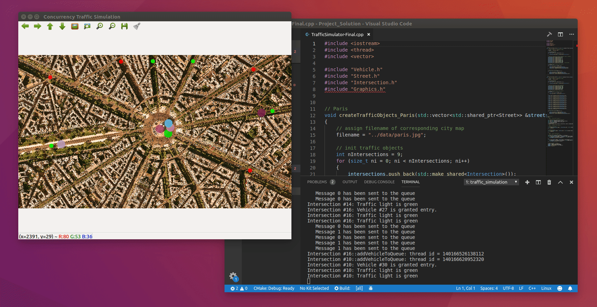

# Udacity - C++ NanoDegree: Concurrent Traffic Simulation Project

Created: June 20, 2022 10:27 AM

This is the project for the fourth course in the [Udacity C++ Nanodegree Program](https://www.udacity.com/course/c-plus-plus-nanodegree--nd213): Concurrency. 

Throughout the Concurrency course, we have been developing a traffic simulation in which vehicles are moving along streets and are crossing intersections.

The code for the final project was built incrementally across all the lessons of this course. As such, this README is structured by the lessons of the course.

## Lesson One: Code overview

In this project, we simulate traffic in a city grid with vehicles, streets, and intersections. Vehicles drive around randomly and change direction at each intersection. 

Each object in the city grid will run independently in its own thread. 

## Class structure

We have a base class, **TrafficObject** (no instance created), and three derived classes, **Intersection, Vehicle, and Street.** The **Graphics class** aids in painting these objects onto a city grid. 

We have **two major flows** of execution. 

In **main()**:

1. We first create and connect **Intersections** and **Streets.** We have two **Intersections** between one **Street.** They have to know about each other in order to manage the flow of traffic. 
2. Next, we add a **Street** and a target **Intersection** to a **Vehicle.** i.e. Each **Vehicle** needs a **Street** on which it can drive, and a destination to which it can drive to (the target **Intersection**).
3. Then, for each **Vehicle,** a thread is started which calls the **Vehicle::drive() function.** 
4. Then, visualising **TrafficObjects** runs in an infinite loop. It is used to visualise the position of the **Vehicles** and is refreshed every few seconds. 

In **Vehicle::drive():**

1. This function is responsible for managing the entire traffic. We start by initialising a stop watch. 
2. We then enter an infinite loop, where we check the time difference to the starting of the stop watch. Depending on the elapsed time, the position of the **Vehicle** on the **Street** is updated. 
3. We then check whether the **Vehicle** has reached the end of the **Street** (90% of **Street** length). 
4. We check the above condition because we require the **Vehicle** to slow down, drive carefully into the **Intersection,** and then follow a new target **Intersection** on a new **Street.** 

## Lesson Two: Passing data between threads - Promises and futures

The traffic simulation from lesson one works in a basic way. i.e. **Vehicles** are driving along **Streets,** from **Intersection** to **Intersection.** Once they reach an **Intersection,** they simply drive through it without checking for other **Vehicles** that may have already been at the **Intersection.** We have to amend for this unsafe situation. 

We will use the concepts learned from passing data between threads to build a communication infrastructure that will prevent **Vehicles** from entering an **Intersection** when there is already another **Vehicle** inside the **Intersection** and crossing it. 

The communication between **Vehicles** and **Intersections** works through a one-time communication channel. Once a **Vehicle** drives to an **Intersection,** it hands out a promise to receive the information in due time when all other **Vehicles** that are currently queued at that **Intersection** have driven off. This feedback is received using a future to proceed to the **Intersection** and drive off. So, if we have five **Vehicles** queuing at the **Intersection** currently, we have five one-time communication channels from the **Vehicles** to this one **Intersection.** 

The blocks in purple are what have been added in lesson two, compared to lesson one. 

In **main():**

1. We have simulate **Intersections.** 
    
    We now start **Intersection** threads (denoted by green). For each **Intersection** in the traffic simulation, we have a thread function, **processVehicleQueue().**
    

In **Intersection::processVehicleQueue():**

1. We have an infinite loop that loops through the entire waiting queue and processes the **Vehicles** in the queue. 
    
    We assume that **Vehicles** have already been added to the queue which happens in the **Vehicle::drive()** function
    
2. First, we check whether there are any **Vehicles** in the queue. 
3. Then, we check for whether there is already another **Vehicle** in the **Intersection** or can we proceed to process the queue. 
4. If there is another **Vehicle** in the intersection, we go back and perform steps 2 and 3. We do this as long as there is not another **Vehicle** in the **Intersection.**
5. Once the **Intersection** is free, we block the **Intersection** for all other **Vehicles** in the queue. 
6. We permit entry to the first **Vehicle** in the queue. 
    
    We have a red arrow here. This is explained in **Intersection::addVehicleToQueue().**
    
7. Finally, we remove this **Vehicle** from the queue. 

In **Intersection::addVehicleToQueue():**

1. Here, we simply add the **Vehicle** to the waiting queue.  
    
    We leave it there. The thread is put to sleep. It does nothing until the signal arrives from **Intersection::processVehicleQueue().**
    
    In step 6 of **Intersection::processVehicleQueue(),** we have a red arrow.
    
    This is a communication channel. 
    
    It is a message which tells us that the permitting function (to permit entry to the first **Vehicle** in the queue) is connected to the function **Intersection::addVehicleToQueue.** 
    
    As soon as the permission comes from step 6 in **Intersection::processVehicleQueue**, we send back a message (saying we have been granted permission to enter the **Intersection**) to the **Vehicle::drive()** function.   
    

In **Vehicle::drive():**

1. We have a new addition to this function.
2. Once a **Vehicle** has reached the end of the **Street,** it has to request entry into the target **Intersection.** 
    
    A thread is started (denoted by the green arrow) with the thread function, **Intersection::addVehicleToQueue().**
    
    Here, we simply add the **Vehicle** to the waiting queue. 
    
    We leave it there. The thread is put to sleep. It does nothing until the signal arrives from **Intersection::processVehicleQueue()** (explained in **Intersection::addVehicleToQueue()**)
    
3. Once the signal comes from **Intersection::processVehicleQueue(),** another signal is sent back to the **Vehicle::drive()** function from the **Intersection::addVehicleToQueue()** function. The **Vehicle** can now safely enter the **Intersection.**
4. Then, as before (in lesson one), it picks a new destination, crosses the **Intersection** and drives off. 

## Lesson Three: Mutexes and locks

At this point of the project, the traffic simulation is working as expected. All **Vehicles** are queuing before entering the **Intersection** in the order that they arrived. 

However, the problem is that the **waitingVehicles member** of the **Intersection class** is a shared resource. (this member is of class **WaitingVehicles defined in the Intersection.h/.cpp files,** and has a vector of **Vehicle objects,** and a vector of promises). It is shared by all the **Vehicle** threads approaching the **Intersection**. We know that when one thread is writing and another thread is either writing or reading, it is a data race. We may not observe the error at the time. We should add a safety layer to avoid this data race. 

## Final lesson/Final project

In addition to **Vehicles**, **Intersections**, and **Streets,** we will also include **TrafficLights** in our simulation to combat increasing traffic in the city. So, each **Intersection** would have a **TrafficLight**. 

A suitable, thread-safe communication protocol between **Vehicles, Intersections,** and **TrafficLights** needs to be established. 

The blocks in purple are the additions to the final project compared to the previous lessons. 

We have a new class called **TrafficLight**

In **Intersection::addVehicleToQueue():**

1. Previously, when the **Vehicle** was added to the waiting queue, the thread was put to sleep.
    
    It had to wait for a signal to arrive from **Intersection::processVehicleQueue()**,
    
    The minute it got that signal, a signal would be sent to the **Vehicle::drive()** function.
    
    Now, we have a **TrafficLight** in between. So, instead of sending the signal to the **Vehicle::drive()** function, we wait until the **TrafficLight** is green. 
    
    i.e. Even though the **Intersection** has allowed the **Vehicle** to enter the **Intersection,** we have to ensure that if the **TrafficLight** is red, the **Vehicle** cannot drive. 
    
2. After we wait for the **TrafficLight** to turn green (a signal that needs to be received from **TrafficLight::cycleThroughPhases()**), we send the signal to the **Vehicle::drive()** function.

The code is designed in such a way that the checking of the **TrafficLight** colour is performed only when the **Vehicle** is about to enter the **Intersection.** So, when the **Vehicle** enters the **Intersection,** and then the **TrafficLight** turns red, it is not an error. 

in **TrafficLight::cycleThroughPhases():**

1. We initialise a stop watch
2. Then, we enter into an infinite loop.
3. We compute the time difference to the stop watch.
4. Then we switch between red and green based on a certain time having elapsed.
5. As soon as the green signal is received, we send an updated message to **Intersection::addVehicleToQueue()**. 
6. To do the above, we have to implement a message queue that works inside the **TrafficLight class.** 

## Dependencies for Running Locally
* cmake >= 2.8
  * All OSes: [click here for installation instructions](https://cmake.org/install/)
* make >= 4.1 (Linux, Mac), 3.81 (Windows)
  * Linux: make is installed by default on most Linux distros
  * Mac: [install Xcode command line tools to get make](https://developer.apple.com/xcode/features/)
  * Windows: [Click here for installation instructions](http://gnuwin32.sourceforge.net/packages/make.htm)
* OpenCV >= 4.1
  * The OpenCV 4.1.0 source code can be found [here](https://github.com/opencv/opencv/tree/4.1.0)
* gcc/g++ >= 5.4
  * Linux: gcc / g++ is installed by default on most Linux distros
  * Mac: same deal as make - [install Xcode command line tools](https://developer.apple.com/xcode/features/)
  * Windows: recommend using [MinGW](http://www.mingw.org/)

## Basic Build Instructions

1. Clone this repo.
2. Make a build directory in the top level directory: `mkdir build && cd build`
3. Compile: `cmake .. && make`
4. Run it: `./traffic_simulation`.
